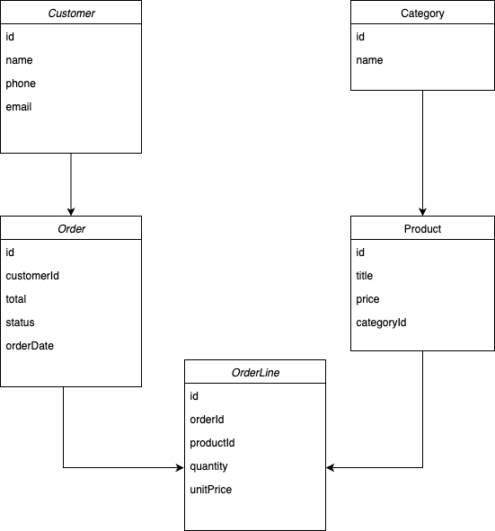

## Savannah Informatics

### ERD

#### Entities
1. user:
	- id: varchar
    - name: varchar 
    - email: varchar
    - phone: varchar
1. category:
    - id: varchar
    - name: varchar
1. product:
	- id: varchar
    - title: varchar
    - price: int
	- category_id: varchar
1. order:
	- id: varchat
    - total: int
    - status string
	- orderdate: timestamp
	- user_id: varchar
1. order_line:
    - id: varchar 
    - unit_price int 
    - quantity int
	- order_id: varchar
	- product_id: varchar

### Architecture 

Structure:
 1. cmd/api/main.go - project entrypoint
 1. api/router/router.go - server initializer
 1. api/resource - modules directory: user, category, product, order, order-line
 1. util/ - dependencies: mailer, sms

